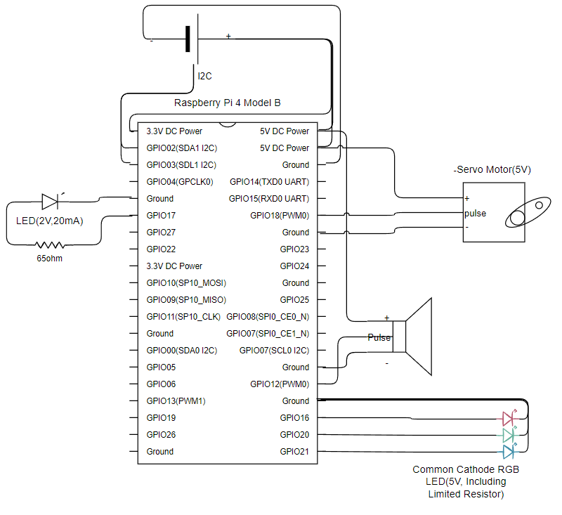
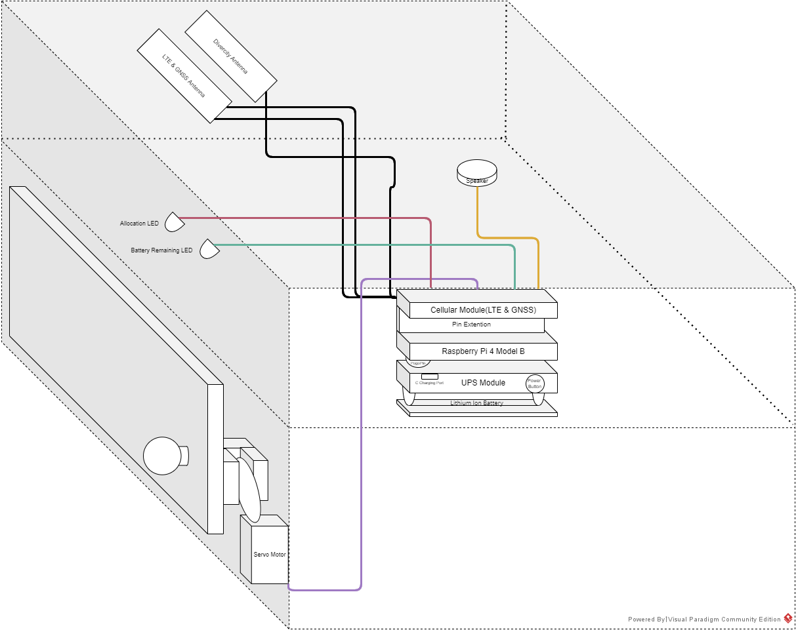

# foodbox_system

## 개요
	- 배달통의 개폐장치에 도어락 적용
	- 도어락 제어 권한 : 가게 및 소비자
	- 모바일 앱을 통한 도어락 제어

## 연구 / 개발 목적
	- 스마트 도어락을 활용한 배달통 내부 음식에 대한 가게, 소비자 외의 접근성 차단
	- 소비자의 도어락 잠금 해제를 통한 배달 음식 수령 근거 확보

## 연구 / 개발 필요성
	- 배달원이 배달 중인 음식을 몰래 섭취하는 행위 방지
	- 소비자의 배달 음식 수령 후 수령 사실 부인 행위 방지

## 서비스 이용 시나리오
	1. 소비자가 배달 주문을 한다.
	2. 가게가 주문 접수를 한다.
	3. 배달통의 QR 코드를 스캔해 주문에 대한 배달통을 할당한다.
	4. 주문된 음식을 배달통 내부에 보관하고 배달통의 도어락을 잠근다.
	5. 배달을 시작한다.
	6. 배달이 도착한다.
	7. 소비자는 도착한 배달통의 도어락을 해제하고 음식을 수령한다.
	8. 해제와 동시에 배달이 완료됐음이 시스템으로 안내된다.
	9. 가게는 주문 장소에 있는 배달통을 수거한다.
	10. 배달통에 대한 주문 할당을 해제한다.

## 개발 대상 시스템 목록
	배달통(Food Box Device) : 스마트 도어락이 적용된 배달통(푸드박스) 기기

	IoT 허브(IoT 허브) : 배달통 기기의 상태를 저장하고 배달통 기기의  하드웨어 제어를 요청하는 서버

	앱 서버(App. Server) : 앱 서비스를 제공하고 IoT 허브에 하드웨어 제어를 요청하는 서버

	가게용 앱(App. For Store) : 가게 측에서 사용할 모의 배달 앱 서비스

	소비자용 앱(App. For Consumer) : 소비자 측에서 사용할 모의 배달 앱 서비스

## 배달통(Food Box Device)
	사용 언어
	- Python : 메인 제어 프로세스
	- Bash Shell Script : 리눅스 부팅 서비스 스크립트(배터리 잔량 체크, 네트워크 체크, IoT 허브 체크)

	하드웨어
	- Raspberry Pi 4 Model B
	- 셀룰러 모듈
	- UPS 모듈(배터리)
	- 서보모터(도어락 제어) 
	- LED(주문 할당 여부 표기)
	- RGB LED(배터리 잔량 표기)
	- 스피커(안내음 출력)

### 회로도

### 장치 구조도

## 서버(IoT Hub & App. Server)
	사용 도구(프레임워크, DBMS)
	- Spring Boot(Java) : IoT Hub 및 App. Server 구현에 이용
	- MariaDB : Database 구현에 이용
	
	동작 환경 : AWS EC2(Ubuntu)

	Protocol
	- HTTP : Client에서 Server로의 통신용
	- WebSocket : Server의 배달통 Device 제어용
  

	제공 서비스 목록
	● 가게 -> 앱 서버
	- 가게 ID 중복 확인
	- 가게 계정 등록
	- 가게 로그인
	- 가게 토큰 재발급
	- 가게 로그아웃
	- 기기 주문 할당
	- 기기 주문 할당 해제
	- 기기 잠금 활성화
	- 기기 잠금 비활성화
	- 배달 시작 안내 요청
	- 주문 접수 목록 전송
	- 주문 접수 정보 전송

	● 소비자 -> 앱 서버
	- 소비자 ID 중복 확인
	- 소비자 계정 등록
	- 소비자 로그인
	- 소비자 토큰 재발급
	- 소비자 로그아웃
	- 배달 주문 요청
	- 기기 잠금 해제 요청
	- 가게 목록 전송
	- 주문 목록 전송
	- 주문 정보 전송

	● 앱 서버 -> IoT Hub	
	- 기기 위치 정보 요청
	- 기기 주문 할당 요청
	- 기기 할당 해제 요청
	- 기기 잠금 요청
	- 기기 잠금 해제 요청

	● Device <-> IoT Hub
	- 허브 연결
	- 배터리 잔량 정보 전송
	- 기기 위치 정보 전송
	- 기기 할당 여부 변경
	- 기기 잠금 여부 변경

## 모의 배달 앱(Store App. & Consumer App.)
	환경(Environment)
	- Framework : React Native Expo(JavaScript)
	- OS :  Android OS, IOS

	주요 기능(가게용 앱)
	- 주문에 대한 배달통 할당 및 해제
	- 배달통 도어락 제어

	주요 기능(소비자용 앱) :
	- 배달 주문
	- 배달통 도어락 해제 및 음식 수령